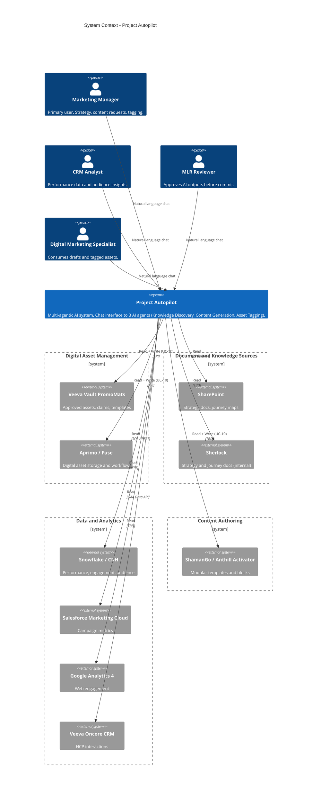

# System Context - Project Autopilot (C4 Level 1)

<!-- DIAGRAM 32.03-diagrams.drawio/system-context -->

> This document is the narrative companion to the C4 System Context diagram. It describes what the system is, who uses it, and what external systems it interacts with - treating Project Autopilot as a single black box.

---

## System Under Description

**Project Autopilot** - A multi-agentic AI system that orchestrates marketing content workflows for Novartis Australia, providing semantic knowledge discovery, compliant content generation, and automated asset tagging through a single conversational interface.

---

## People (Actors)

| Actor | Description | Relationship to Autopilot |
|---|---|---|
| **Marketing Manager** | Drives campaign strategy across 70+ brands. Primary user (~25 people). | Asks questions, requests content drafts, and initiates asset tagging via natural language. Approves AI outputs before they are committed. |
| **CRM Analyst** | Owns customer segmentation and lifecycle campaigns. | Queries campaign performance data and audience insights through the same interface. |
| **MLR Reviewer** | Medical/Legal/Regulatory reviewer ensuring compliance with Medicines Australia Code of Conduct. | Reviews and approves AI-generated content and metadata tags before write-back to source systems. |
| **Digital Marketing Specialist** | Builds and publishes campaigns across digital platforms. | Uses content drafts and tagged assets produced by Autopilot as inputs to their publishing workflow. |

All actors interact with Autopilot through its natural-language chat interface (the Autopilot Assistant).

---

## External Systems

### Digital Asset Management

| System | Description | Interaction |
|---|---|---|
| **Veeva Vault PromoMats (VVPM)** | Primary DAM for approved promotional materials, claim libraries, and compliance references. | Autopilot reads approved assets, templates, and claims. UC-10 writes metadata tags back (with human approval). |
| **Aprimo / Fuse** | Secondary DAM platform for digital asset storage and workflow. | Autopilot reads assets and metadata. UC-10 writes tags back (with human approval). |

### Document and Knowledge Sources

| System | Description | Interaction |
|---|---|---|
| **SharePoint** | Strategy documents, journey maps, and planning materials (post G-Drive migration). | Autopilot reads documents for knowledge discovery. Read-only. |
| **Sherlock** | Internal Novartis tool holding strategy and journey documentation. | Autopilot reads strategy context. Read-only. API maturity unknown - high integration risk. |

### Data and Analytics Platforms

| System | Description | Interaction |
|---|---|---|
| **Customer Data Hub / Snowflake** | Central data warehouse holding campaign performance, engagement metrics, and audience data. | Autopilot reads performance data and audience segments. Read-only. |
| **Salesforce Marketing Cloud (SFMC)** | Email and journey campaign platform with engagement and send metrics. | Autopilot reads campaign performance data. Read-only. |
| **Google Analytics 4 (GA4)** | Website engagement and content performance analytics. | Autopilot reads engagement metrics. Read-only. |
| **Veeva Oncore CRM** | HCP interaction history, engagement logs, and usage data. | Autopilot reads CRM data for audience context. Read-only. |

### Content Authoring

| System | Description | Interaction |
|---|---|---|
| **ShamanGo / Anthill Activator** | Modular content template system and content block library. | Autopilot reads templates and content blocks. UC-10 writes tags back (with human approval). High integration risk - referenced as "future state" in RFP. |

---

## Interaction Summary

---

## Key Boundaries

### What Is Inside the System Boundary

- The Autopilot Assistant (chat interface)
- Three AI agents (Knowledge Discovery, Content Generation, Asset Tagging)
- The integration layer that connects agents to external systems
- LLM inference, vector storage, and orchestration infrastructure
- Observability, audit logging, and RBAC controls

### What Is Outside the System Boundary

- All nine source systems (owned and operated by Novartis)
- API provisioning for source systems (Novartis responsibility)
- Data quality and completeness in source systems
- Compliance rule authoring (Novartis SMEs define; Cevo codifies)
- Base LLM model training (prohibited)
- The full Autopilot Workbench (Phase 2/3 - out of PoC scope)

---

## Data Flow Direction

| Direction | Systems | Notes |
|---|---|---|
| **Read (inbound to Autopilot)** | All 9 systems | Agents query source systems to retrieve assets, documents, metrics, and templates |
| **Write (outbound from Autopilot)** | VVPM, Aprimo, ShamanGo | Only UC-10 (Asset Tagging) writes back. All writes require human approval before commit. |

No system pushes data to Autopilot. All interactions are Autopilot-initiated (pull model).

---

## Trust Boundaries

| Boundary | Significance |
|---|---|
| Autopilot to external systems | Autopilot authenticates to each system via API credentials (mechanism TBD per system). All data retrieved is treated as authoritative source material. |
| User to Autopilot | Users authenticate via RBAC. Role determines which agents and data sources are accessible. |
| Autopilot to LLM (Bedrock) | Queries sent to Bedrock do not include raw PII. No Novartis data is used for model training. Cross-region inference and data residency enforcement are open questions. |
| Write-back boundary | Any action that modifies an external system must pass through human approval. The system cannot autonomously write to production data stores. |

---

## Open Architecture Questions

These are unresolved decisions that affect how this context diagram translates to implementation:

| # | Question | Impact | Reference |
|---|---|---|---|
| 1 | API gateway vs. MCP server per system? | Determines the integration pattern between Autopilot and each external system | 2026-08-12 planning session |
| 2 | AI Shared Services account vs. project-specific Bedrock? | Determines whether LLM inference is a shared platform service or contained within the project boundary | 2026-08-17 planning session |
| 3 | Cross-region inference - can it be disabled? | Affects data residency compliance | 2026-08-21 readiness notes |
| 4 | AI Gateway pattern needed? | May introduce an additional intermediary between Autopilot and Bedrock | 2026-08-17 planning session |

---

## Related Documents

- [System Overview](32.03-system-overview.md) - broader context and governing principles
- [Interaction Summary Matrix](32.02-interaction-summary-matrix.md) - per-agent x per-system interaction detail
- [Container Diagram](32.05-container-diagram.md) - what's inside the system boundary (C4 Level 2)
- [Scope Boundary](../../20-29_problem/21_context/21.01d-scope-boundary.md) - formal in/out/grey zone definition

---

*Status: Draft*
*Version: 1.0*
*Created: 2026-08-25*
